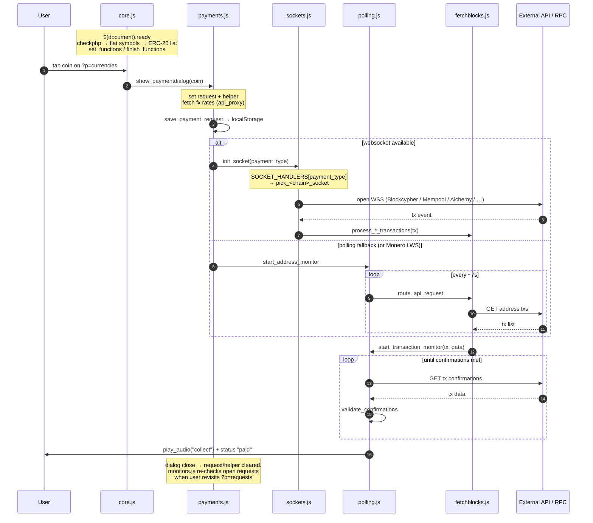
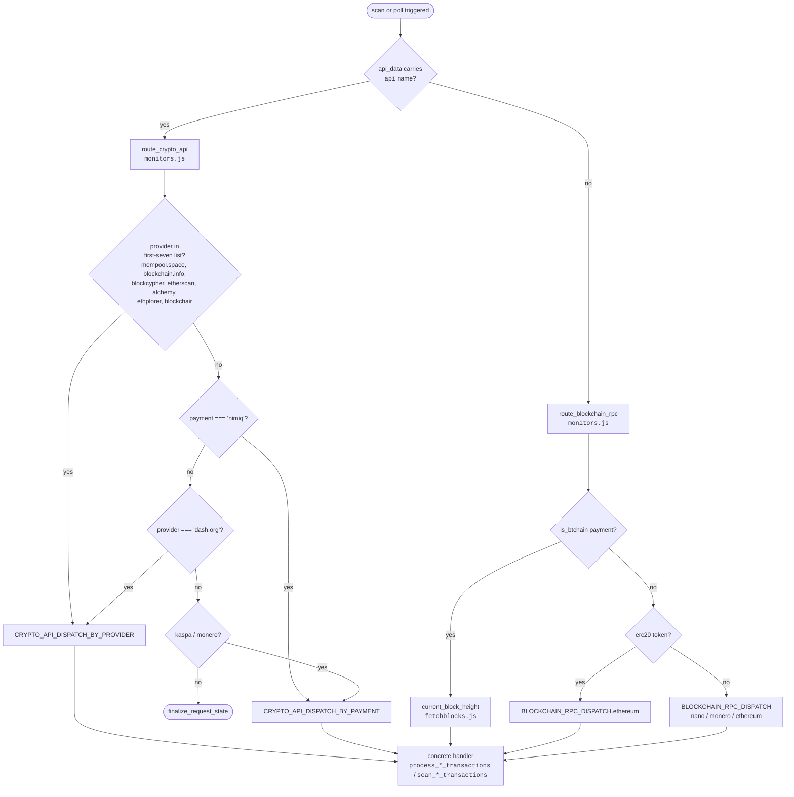
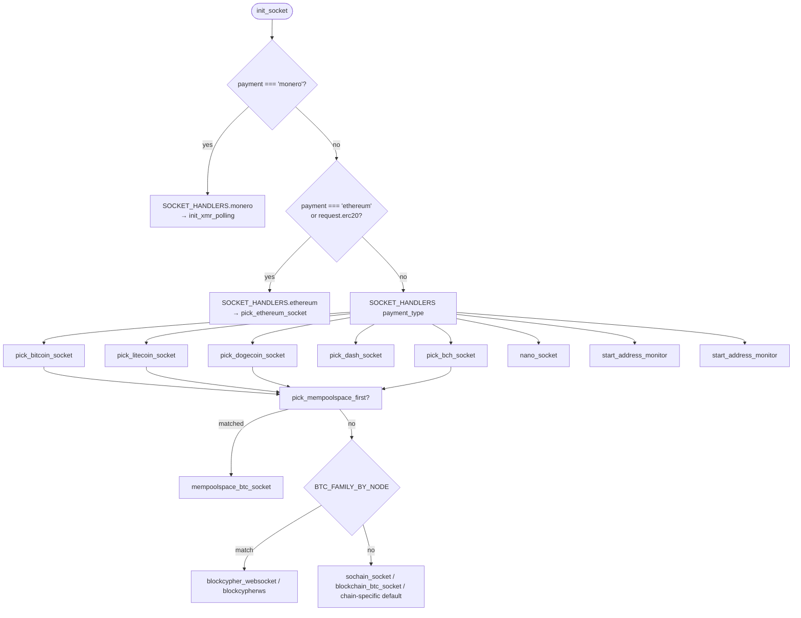

# Bitrequest Architecture

A tour of the codebase for new contributors. Read this once; you'll then know
where to start grepping for anything specific.

---

## What the app is

Bitrequest is a **non-custodial cryptocurrency point-of-sale PWA**. It's a
single-page web app that lets anyone accept crypto payments, hand-coded in
vanilla JS with jQuery as the DOM library. No build tools, no bundler, no
package manager, no runtime dependencies beyond what ships in `assets/js/`.

Everything cryptographic happens **client-side**. Private keys never leave the
device. A small PHP "proxy" sits between the client and third-party APIs to:

1. Hold API keys server-side so they aren't leaked to the browser
2. Cache responses so we don't burn through API quotas
3. Mediate Lightning Network node access (LND/CLN/LNbits/Spark/NWC)

The app is hosted statically (GitHub Pages by default, `app.bitrequest.io` and
mirrors as proxies). It also ships as iOS (App Store) and Android (TWA)
wrappers around the same PWA.

---

## Big-picture layout

```
.
├── index.html                 # SPA shell + all DOM scaffolding
├── manifest.json              # PWA manifest
├── serviceworker.js           # Offline cache (precaches everything in index.html)
├── assets/
│   ├── js/
│   │   ├── lib/               # Shared libs (jQuery, sjcl, crypto utils, helpers)
│   │   └── bitrequest/        # First-party app code (one file per concern)
│   ├── styles/                # CSS
│   ├── sounds/                # MP3 payment chimes
│   └── img/                   # Icons, coin logos
├── proxy/                     # PHP API + Lightning proxy
├── unit_tests/                # Standalone HTML test runners for crypto libs
└── *.md                       # Docs (this file, coin-add guide, etc.)
```

---

## File map

### `assets/js/lib/` — shared libraries

| File | Purpose |
|------|---------|
| `jquery.js` | jQuery 3.x slim. DOM library. Used everywhere. |
| `libraries.js` | Tiny shims (Bech32, base32, JSEncrypt loaders). |
| `sjcl.js` | Stanford JS Crypto Library — AES used for seed encryption. |
| `crypto_utils.js` | secp256k1 + Ed25519 + Blake2b + Keccak. Standalone, also published as [crypto-utils-js](https://github.com/bitrequest/crypto-utils-js). |
| `xmr_utils.js` | Monero / Zano (CryptoNote curve) helpers. Standalone, also [xmr-utils-js](https://github.com/bitrequest/xmr-utils-js). |
| `bip39_utils.js` | BIP39 mnemonic + BIP32/BIP44/SLIP-0010 derivation. Standalone, also [bip39-utils-js](https://github.com/bitrequest/bip39-utils-js). |
| `gd_api.js` | Google Drive backup integration. |
| `global_queries.js` | The catch-all utility file. Defines `glob_const`/`glob_let`, `api_proxy`, storage helpers, URL schemes, formatting, and the DOM data accessors (`get_setting`, `get_requestli`, etc.). Everything in here is callable from any other file. |

### `assets/js/bitrequest/` — first-party code

| File | Owns |
|------|------|
| `lang_meta.js` + `lang_controller.js` + `lang/*.js` | Translation system. Each `lang/<code>.js` is a flat key→string map; `tl("key")` looks it up. |
| `config.js` | `glob_config` — every coin's metadata, API list, RPC list, wallet list, default settings. **This is the master config; most coin-specific behavior is data-driven from here.** |
| `assets.js` | UI templates as JS strings (icons, list items, dialog markup). |
| `core.js` | Boot sequence, navigation, dialog management, scanner, page lifecycle. Where `$(document).ready` lives. The largest file (~5,500 LOC). |
| `settings.js` | Everything under `?p=settings` — currency picker, exchange-rate API selection, theme, backup/restore, PIN, team invites. |
| `coin_settings.js` | Per-currency settings UI (the gear icon on each coin). |
| `bip39.js` | Seed phrase generation, derivation, address management UI. |
| `payments.js` | The payment dialog. Opens when you create or open a request. Handles amount entry, currency conversion, swipe gestures, the actual "show this address + monitor for payment" flow. |
| `fetchblocks.js` | All blockchain RPC and block-explorer API integrations. One function per API per coin. Returns parsed `tx_data` objects. |
| `rpcs.js` | RPC-flavored block height queries (Electrum, mempool.space, Infura, nano_rpc, etc.). Companion to `fetchblocks.js`. |
| `sockets.js` | WebSocket subscriptions for live address monitoring (Blockcypher, Alchemy, Kaspa, etc.) and the NFC reader. |
| `polling.js` | Fallback when sockets aren't available. Also the Monero LWS polling loop. |
| `monitors.js` | The "requests list" status loop. Re-scans open requests periodically to keep their status fresh. |
| `lightning.js` | Lightning Network setup, invoice creation, LNURL handling, LND/CLN/LNbits/Spark/NWC node management. |
| `ethl2.js` | Ethereum Layer 2 routing (Base, Arbitrum, Polygon, BSC) and ERC-20 contract resolution. |

### `proxy/` — PHP backend

Versioned under `proxy/v1/`. The structure:

```
proxy/
├── config.php              # API keys & Lightning node configs (NOT in repo — copy from example)
└── v1/
    ├── index.php           # Generic API proxy entry point (POST → /proxy/v1/)
    ├── api.php             # Shared API helper (caching, HTTP fetch)
    ├── filter.php          # Request validation / sanitization
    ├── custom/             # Per-chain custom RPC handlers (electrum, nano)
    │   └── rpcs/
    ├── inv/                # Invoice / receipt rendering
    ├── ln/
    │   ├── index.php
    │   └── api/
    │       ├── index.php           # Lightning proxy — ALL backends dispatched here
    │       ├── secp256k1.php       # Shared crypto for Spark/NWC
    │       ├── spark/              # Spark protocol helpers (preimage, ECIES)
    │       └── nwc/                # NIP-47/NWC helpers
    ├── themes/             # CSS themes for hosted receipts
    └── receipt/
```

**Two endpoints the client hits:**

| Endpoint | Handler | Purpose |
|----------|---------|---------|
| `POST /proxy/v1/` | `v1/index.php` | Generic API proxy. Client POSTs `api`, `api_url`, `cachetime`, `cachefolder`, etc. Server looks up the key from `config.php`, fetches, caches, returns. |
| `POST /proxy/v1/ln/api/` | `v1/ln/api/index.php` | Lightning proxy. Client POSTs `fn` (function name) + `imp` (implementation: `lnd`/`core-lightning`/`lnbits`/`nwc`/`spark`). Server dispatches via `if ($imp === ...)` branches. |

Self-hosting the proxy is supported (Settings → Advanced → API Proxy). See
`proxy/README.md` for setup.

---

## The four globals

Bitrequest has no module system. State lives in four script-scope variables
declared in `global_queries.js`. Understanding these is most of understanding
the codebase.

### `glob_const` — read-only config

Set once at boot. Contains: hostname, proxy URL list, jQuery references to
top-level DOM nodes (`$("body")`, `$("html")`, etc.), feature-detection
results (`is_safari`, `has_bigint`, `ls_support`), cache TTLs, RPC endpoints,
audio buffers. Never mutated after `$(document).ready`.

### `glob_let` — runtime state

Mutated freely throughout the app's lifetime. ~60 keys. Each one is tagged
with its owning file in the source (see top of `global_queries.js` around
line 186). If you're tracking down "where is this set?", start with the
owner file.

Big categories: polling timer IDs (`tpto`, `pinging`), socket registry
(`sockets`, `socket_attempt`), Monero scan state (`xmr_indexed`), BIP39
setup (`bipid`, `bipobj`, `phrasearray`), UI flags (`blockswipe`, `ctrl`,
`scrollposition`), boot state (`init`, `io`, `local`).

### `request` and `helper` — current dialog state

```js
let request = null,
    helper  = null;
```

Both `null` when no payment dialog is open. **Every function in `payments.js`,
`sockets.js`, `polling.js`, `monitors.js`, and `fetchblocks.js` reads from
them** as if they were globals.

- `request` is the persisted request record (address, amount, currency,
  status, txhash, lightning data). It mirrors a localStorage entry but is the
  live working copy.
- `helper` is ephemeral context for the current dialog (chosen api_data node,
  LND connection status, L2 status flags).

They're set in `payments.js → show_paymentdialog` and cleared when the
dialog closes. **The implicit contract: don't read them when no dialog is
open.** The existing pattern across the codebase is to guard with
`is_openrequest()` or `if (request) { ... }` before accessing them — follow
that when adding code that could fire after close (deferred timers, socket
callbacks).

---

## The request lifecycle

This is the path a single payment takes from "user taps a coin" to "tx
confirmed."

1. **Boot.** `core.js → $(document).ready`: load settings from localStorage,
   verify PHP proxy support (`checkphp`), fetch fiat symbol list, fetch ERC-20
   token list, then call `set_functions()` and `finish_functions()` which
   bind every event handler.

2. **User picks a coin** on `?p=currencies`. Click handler → loads the coin's
   `address_regex` and `urlscheme` from `glob_config.bitrequest_coin_data`.

3. **User taps "new request."** `payments.js → show_paymentdialog` opens the
   dialog, sets `request` and `helper`, populates the amount input.

4. **User enters amount + (optionally) fiat conversion.** `payments.js →
   get_cc_exchangerates → get_fiat_exchangerate` fetches rates via
   `api_proxy()`. Rates cached in sessionStorage.

5. **Dialog shows address + QR + amount.** `payments.js → save_payment_request`
   writes the request to localStorage, then routes to monitoring.

6. **Live monitoring starts** (one of two paths):
   - **Websocket** (`sockets.js → init_socket`): dispatches via
     `SOCKET_HANDLERS[payment_type]` to a `pick_<chain>_socket` function,
     which opens a WebSocket via Blockcypher / Mempool.space / Alchemy / etc.
     Fires `process_*_transactions` callback on incoming tx.
   - **Polling** (`polling.js → start_address_monitor`): `setInterval` calling
     `route_api_request` every 7s. Used when sockets aren't available or for
     Monero (LWS polling).

7. **Tx detected** → `fetchblocks.js → process_*_transactions` parses the raw
   API response into a `tx_data` object (`{txhash, amount, confirmations,
   timestamp, ...}`).

8. **Confirmation tracking.** `polling.js → start_transaction_monitor` polls
   the txhash for confirmations until `validate_confirmations` returns
   `"paid"`. Sound plays (`play_audio("collect")`), request status updates to
   `"paid"`.

9. **Dialog can be closed.** `request` and `helper` clear. Open requests are
   later re-checked by `monitors.js` when the user revisits `?p=requests`.

### Lifecycle at a glance



---

## The API proxy contract

Every external API call goes through `api_proxy()` in `global_queries.js`
(line ~1526). It does one of three things:

1. **Direct call** (`ad.proxy === false` or coin has a public no-key API):
   `$.ajax` straight to the third party.
2. **Proxied call** (default): `POST <proxy_root>/proxy/v1/` to
   `v1/index.php`. PHP looks up the API key from `config.php`'s `$keys`
   array, appends it to the URL, fetches, returns the response wrapped in
   `{ping: {br_cache: {...}, br_result: ...}}`.
3. **Tor proxy** (`.onion` URLs): adds a `tor_proxy` field pointing at a
   random Tor-capable proxy from `glob_let.tor_proxies`.

The POST body sent to `v1/index.php` for a generic proxied call:

```
api          : "coingecko"        // matched against $keys[<name>] in config.php
api_url      : "https://api.coingecko.com/api/v3/simple/price?ids=..."
api_key      : null               // or the user-supplied key
key_param    : "?key="            // how to append the key to URL
ampersand    : "?" or "&"
nokey        : "true" if API needs no key
cachetime    : 120                // preferred TTL in seconds
cachefolder  : "1d" | "1w" | "1h" | "2m" | "tx"   // server-side cache bucket
params       : { method, headers, data }
```

Valid `cachefolder` values are defined in `proxy/v1/api.php`'s
`CACHE_DURATIONS` constant. The client picks from `glob_const.cache_ttl`.

All proxy responses include a `proxy_version` field. If the client's
`glob_const.proxy_version` is newer than the server's, `proxy_alert()`
fires.

The proxy round-trip is decoded by `br_result(e)`, which returns
`{proxy: bool, result: ...}` — almost every API callback starts with
`const api_result = br_result(e);`.

For Lightning, the contract is different: `POST <proxy>/proxy/v1/ln/api/`
with `fn` (function: `ln-create-invoice`, `ln-invoice-status`, etc.) and
`imp` (`lnd` / `core-lightning` / `lnbits` / `nwc` / `spark`). The server
dispatches via `if ($imp === ...)` branches inside each top-level function
in `v1/ln/api/index.php`. See `CONTRIBUTING_LIGHTNING.md`.

### Dispatch routing

When a request is being checked (either as an initial scan or as a tx poll),
the path from "we need to talk to a chain" to "the right per-chain handler
runs" goes through three dispatch tables. The branch order in
`route_crypto_api` and `init_socket` is significant — see the comment headers
above those functions before reordering.



The WebSocket side has its own dispatch in `sockets.js → init_socket`.
Same branch-order caveat applies: monero is checked before ethereum/erc20
before everything else.



---

## Running locally

```sh
# Static server, no PHP. App will detect `local` host and disable proxied APIs.
python3 -m http.server 8000
# Then open http://localhost:8000
```

For full functionality (proxied APIs, Lightning), run with PHP enabled:

```sh
php -S localhost:8000 -t .
```

The app autodetects PHP availability via `core.js → checkphp` (calls the
fixer.io endpoint through the proxy; success = PHP works).

---

## Coding conventions

- **No build step.** Edit JS files in place, refresh the browser. The
  service worker may serve stale code — DevTools → Application → Service
  Workers → "Update on reload" while developing.
- **One file per concern.** New websocket integration? `sockets.js`. New
  blockchain explorer? `fetchblocks.js`. New coin? See `bitrequest_add_coin_guide.md`.
- **Vanilla JS + jQuery.** No frameworks, no React, no transpiling.
- **Indentation:** 4 spaces.
- **Strings:** double quotes.
- **Functions:** snake_case. Variables: snake_case. Globals: `glob_*`.
- **Comments above functions are doc comments**: one-line description of
  what the function does, what it returns, what side effects it has.
- **DOM is a data store** (see `DOM_DATA.md`). Most state attached to
  list items lives in `.data()` calls, not JS objects.
- **No `"use strict"`** historically. New files should opt in to catch
  implicit globals.

---

## Where to look next

- Adding a coin: [`bitrequest_add_coin_guide.md`](bitrequest_add_coin_guide.md)
- Adding a Lightning backend: [`CONTRIBUTING_LIGHTNING.md`](CONTRIBUTING_LIGHTNING.md)
- Adding a fiat-rate / crypto-rate API: [`CONTRIBUTING_FIAT_API.md`](CONTRIBUTING_FIAT_API.md)
- Adding a WebSocket source: [`CONTRIBUTING_SOCKETS.md`](CONTRIBUTING_SOCKETS.md)
- DOM data attribute schema: [`DOM_DATA.md`](DOM_DATA.md)
- Proxy setup: [`proxy/README.md`](proxy/README.md)
- Translations: [`TRANSLATE_PROMPT.md`](TRANSLATE_PROMPT.md)
